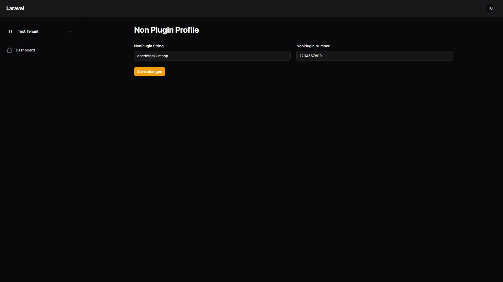
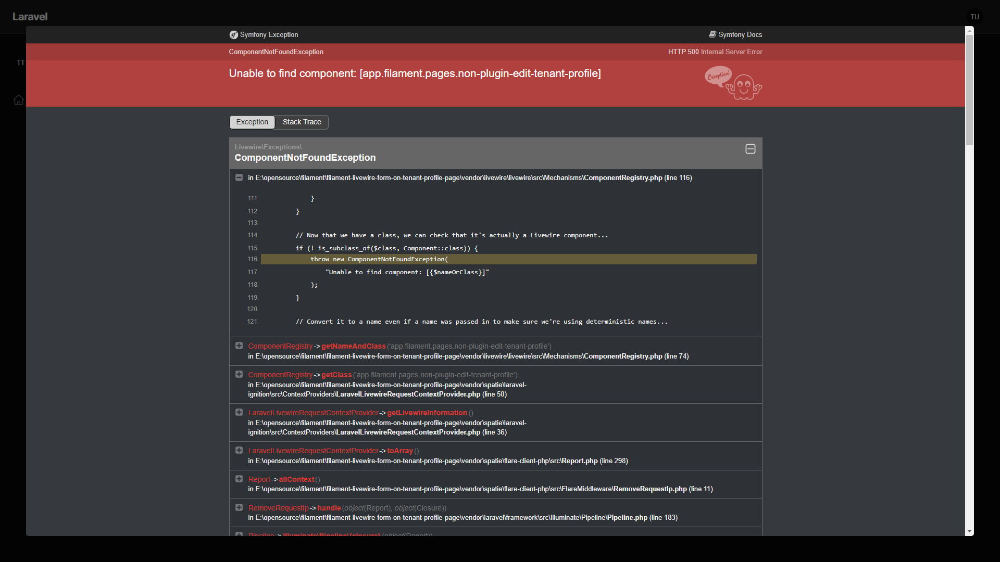
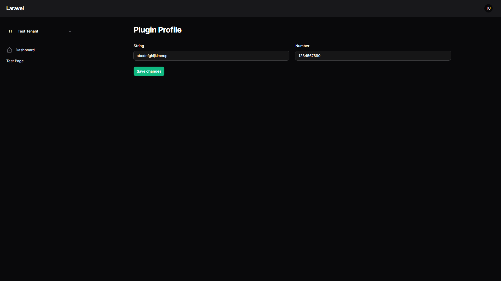
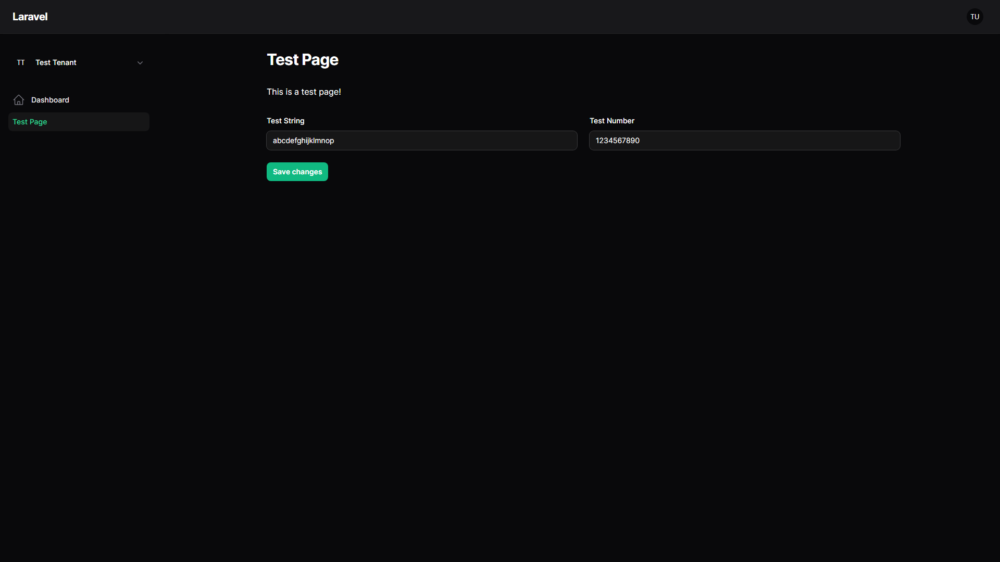
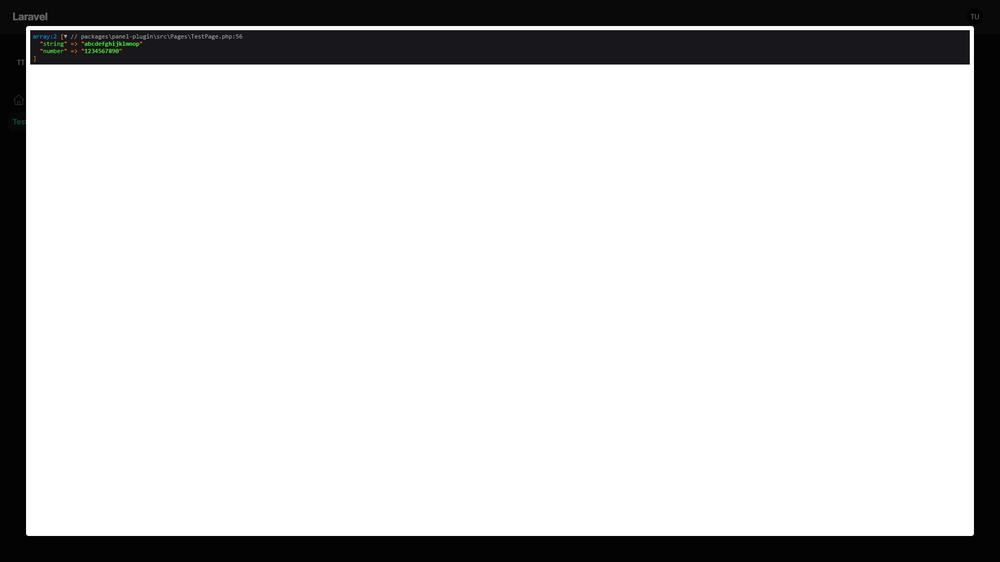

### How was the project created ?

```shell
laravel new filament-livewire-form-on-tenant-profile-page

composer require filament/filament:"^3.2.80" -W
php artisan filament:install --panels
```

```shell
mkdir packages packages/panel-plugin
cd packages/panel-plugin
composer init
```

## Quick Setup

```shell
composer install
npm install
php artisan migrate --seed
```

### What is the problem ?

The class [EditTenantProfile](vendor/filament/filament/src/Pages/Tenancy/EditTenantProfile.php) seems to be broken no matter if using inside a plugin or outside.

Unsure why this is happening but when "submitting" a form on the tenant profile page it attempts to render a component that does not exist.

Here are the examples and how to replicate the problem:

1. Non-Plugin Tenant Profile Page

   - Navigate to `$APP_URL/nonplugin` login if not already done. In the top left expand tenant dropdown menu and click on `Non Plugin Profile`

    

    - Now click on `Save changes` and error will be thrown.

    

2. Plugin Tenant Profile Page

   - Navigate to `$APP_URL/admin` login if not already done. In the top left expand tenant dropdown menu and click on `Plugin Profile`

    

   - Now click on `Save changes` and error will be thrown.

    

3. Non Plugin Tenant Registration Page

    - Navigate to `$APP_URL/nonplugin/new` login if not already done.
    
    

    - Click on `Non Plugin Register` and an error will be thrown. 

    

### Expected Behavior

- Navigate to `$APP_URL/admin` login if not already done. In the sidebar navigation click on `Test Page`

    

- Now click on `Save changes` and **NO** error will be thrown. But instead the `save()` function is called and the `$data` array is dumped.

    
