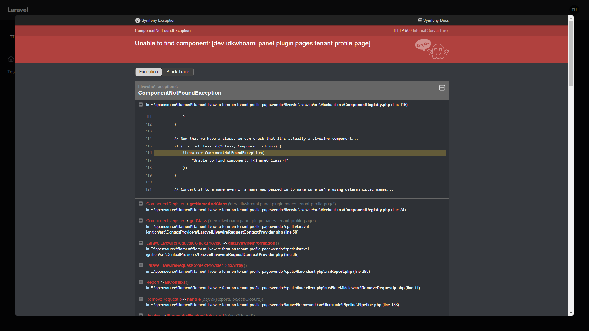

### Possible Fix ?

In Livewire [ComponentRegistry.php](vendor/livewire/livewire/src/Mechanisms/ComponentRegistry.php) the function `nameToClass`

```php
protected function nameToClass($name)
    {
        // Check the aliases...
        if (isset($this->aliases[$name])) {
            if (is_object($this->aliases[$name])) return $this->aliases[$name]::class;

            return $this->aliases[$name];
        }

        // Hash check the non-aliased classes...
        foreach ($this->nonAliasedClasses as $class) {
            if (crc32($class) === $name) {
                return $class;
            }
        }
        $generatedClass = $this->generateClassFromName($name);

        /*
         * This prevents submission issues on Filament Tenant Pages.
         * No idea why ?
         * Maybe the page component is not registered correctly hence why livewire cant find the proper class and adds the App\Livewire\ at the front
         * 
         * Although this doesn't fix the issue itself its just the reason for the error.
         * The source has top be somewhere higher up the chain.
         * */
        if(str_starts_with($generatedClass, "\App\Livewire\App\Filament\Pages")) {
            $generatedClass = str_replace("\App\Livewire\App", 'App', $generatedClass);
        }

        // Reverse generate a class from a name...
        return $generatedClass;
    }
```

So i found the actual source of the problem. As i tought the components are not being registered at all actually.

In FilamentPHP [HasComponents.php](vendor/filament/filament/src/Panel/Concerns/HasComponents.php) the function `registerLivewireComponents`

```php
.
.
.

    // This works and was there already
    if ($this->hasLogin() && is_subclass_of($loginRouteAction = $this->getLoginRouteAction(), Component::class)) {
        $this->queueLivewireComponentForRegistration($loginRouteAction);
    }

    /*
     * The following three checks / registrations are missing right now. Seems so few people actually use this feature that nobody noticed you can't actually use it the intended way ^^
     * 
     * I will be making a PR for these 6 lines. I dont think it will break anything but who knows ^^
     * */
    if ($this->hasTenantRegistration() && is_subclass_of($tenantRegistrationComponent = $this->getTenantRegistrationPage(), Component::class)) {
        $this->queueLivewireComponentForRegistration($tenantRegistrationComponent);
    }

    if ($this->hasTenantProfile() && is_subclass_of($tenantProfileComponent = $this->getTenantProfilePage(), Component::class)) {
        $this->queueLivewireComponentForRegistration($tenantProfileComponent);
    }

    if ($this->hasProfile() && is_subclass_of($profilePageComponent = $this->getProfilePage(), Component::class)) {
        $this->queueLivewireComponentForRegistration($profilePageComponent);
    }

```


### How was the project created ?

```shell
laravel new filament-livewire-form-on-tenant-profile-page

composer require filament/filament:"^3.2.80" -W
php artisan filament:install --panels
```

```shell
mkdir packages packages/panel-plugin
cd packages/panel-plugin
composer init
```

## Quick Setup

```shell
composer install
npm install
php artisan migrate --seed
```

### What is the problem ?

The class [EditTenantProfile](vendor/filament/filament/src/Pages/Tenancy/EditTenantProfile.php) seems to be broken no matter if using inside a plugin or outside.

Unsure why this is happening but when "submitting" a form on the tenant profile page it attempts to render a component that does not exist.

Here are the examples and how to replicate the problem:

1. Non-Plugin Tenant Profile Page

   - Navigate to `$APP_URL/nonplugin` login if not already done. In the top left expand tenant dropdown menu and click on `Non Plugin Profile`

    

    - Now click on `Save changes` and error will be thrown.

    

2. Plugin Tenant Profile Page

   - Navigate to `$APP_URL/admin` login if not already done. In the top left expand tenant dropdown menu and click on `Plugin Profile`

    

   - Now click on `Save changes` and error will be thrown.

    

3. Non Plugin Tenant Registration Page

    - Navigate to `$APP_URL/nonplugin/new` login if not already done.
    
    

    - Click on `Non Plugin Register` and an error will be thrown. 

    

### Expected Behavior

- Navigate to `$APP_URL/admin` login if not already done. In the sidebar navigation click on `Test Page`

    

- Now click on `Save changes` and **NO** error will be thrown. But instead the `save()` function is called and the `$data` array is dumped.

    
